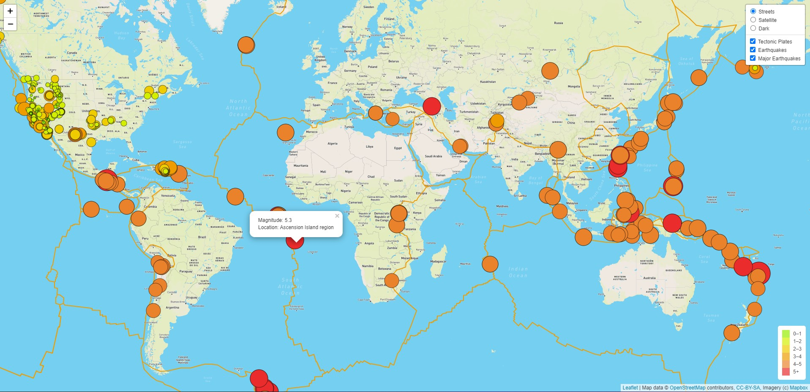

# Mapping_Earthquakes

## Background
Build insightful data visualizations with interactive features on earthquakes from around the world.  Using the latest earthquake GeoJSON data from the U.S. Geologiical Survey website, you will traverse and retrieve the earthquake data using JavaScript and the D3 and leaflet libraries, and plot the data on a Mapbox map through an API request.

Basil and Sadhana like how you created your earthquake map with two different maps and the earthquake overlay. Now, Basil and Sadhana would like to see the earthquake data in relation to the tectonic plates’ location on the earth, and they would like to see all the earthquakes with a magnitude greater than 4.5 on the map, and they would like to see the data on a third map.

## Deliverable
1. Deliverable 1: Add Tectonic Plate Data
2. Deliverable 2: Add Major Earthquake Data
3. Deliverable 3: Add an Additional Map

* [index.html] (./Earthquake_Challenge/index.html)
* [style.css] (./Earthquake_Challenge/static/css/style.css) 
* [challenge_logic.js] (./Earthquake_Challenge/static/js/challenge_logic.js)

## Result

